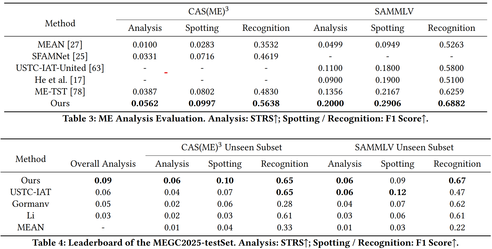

# BoostingVRME



## 🔧 Setup

STEP1: `bash setup.sh`

STEP2: `conda activate BoostVRME`

STEP3: `pip install -r ./requirements.txt` 


## 💻 Example of Using Pre-trained Models

If you want to run the pre-trained model on SAMMLV, use `python main.py --dataset_name SAMMLV --train False`

Note: The preprocessed data and pre-trained models can be obtained through the link: https://drive.google.com/drive/folders/1eSZWKSagQDt2w9ua3fSPJGKA0POVqJo0?usp=sharing


## 💻 Examples of Neural Network Training

STEP 1: Download the $CAS(ME)^3$ raw data by asking the paper authors

STEP 2: Modify `main.py; load_excel.py; load_images.py`

STEP 3: Run `python main.py --dataset_name CASME_3 --train True --flow_process True` 


## 🎓 Acknowledgement

We referred to [MEAN_Spot-then-recognize](https://github.com/genbing99/MEAN_Spot-then-recognize), and would like to express our sincere thanks to the authors.


## 📜 Citation

If you find this repository helpful, please consider citing:

```
@inproceedings{10.1145/3746027.3762026,
  title={Boosting Micro-Expression Analysis via Prior-Guided Video-Level Regression},
  author={Guo, Zizheng and Zou, Bochao and Jia, Yinuo and Li, Xiangyu and Ma, Huimin},
  year={2025},
  isbn = {9798400720352},
  publisher = {Association for Computing Machinery},
  address = {New York, NY, USA},
  doi = {10.1145/3746027.3762026},
  booktitle={Proceedings of the 33st ACM International Conference on Multimedia},
  location = {Dublin, Ireland},
  series = {MM '25}
}
```